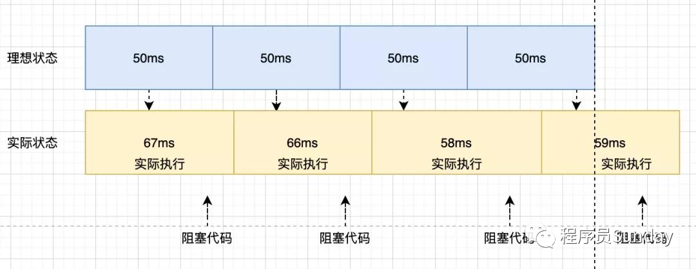
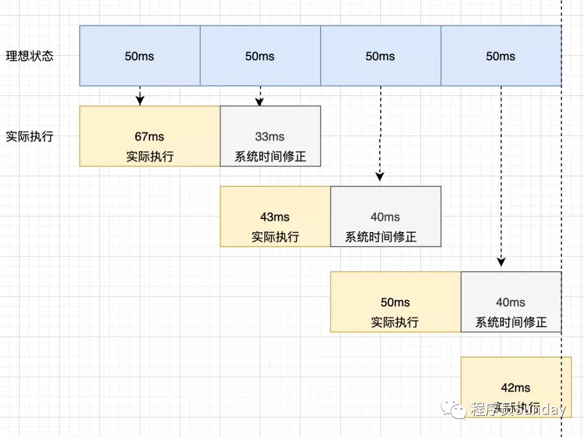

<script setup>
  import PageIndex from './PageIndex.vue'
  import PageIndex2 from './PageIndex2.vue'
</script>

# 为什么会不准时?

因为 setTimeout 是一个宏任务，它的指定时间指的是：**进入宏任务队列的时间**。进入宏任务队列后需要等待主线程和微任务队列都清空结束后才会进行下一个宏任务队列循环。

<page-index />

```js
function timer() { 
  let speed = 50, // 设定间隔 
  counter = 1,  // 计数 
  start = new Date().getTime(); 
    
  function instance() { 
    const ideal = (counter * speed), 
    real = (new Date().getTime() - start); 
    
    counter++; 
    form.ideal = ideal; // 记录理想值 
    form.real = real;   // 记录真实值 

    const diff = (real - ideal); 
    form.diff = diff;  // 差值 

    time = setTimeout(function() { instance(); }, speed); 
  }; 
  time = setTimeout(function() { instance(); }, speed); 
}
timer(); 
```

通过上面例子可以看出差值会逐步增大，如果在增加一些额外的代码逻辑，例如循环几百万个数据，差值会进一步扩大。


# setTimeout 系统时间补偿



当每一次定时器执行时后，都去获取系统的时间来进行修正，虽然每次运行可能会有误差，但是通过系统时间对每次运行的修复，能够让后面每一次时间都得到一个补偿。

::: tip
实际运用: 倒计时组件
:::

```js
function timer() {
  let speed = 50, // 设定间隔 
  counter = 1,  // 计数 
  start = new Date().getTime(); 
    
  function instance() { 
    const ideal = (counter * speed), 
    real = (new Date().getTime() - start); 
    
    counter++; 
    form.ideal = ideal; // 记录理想值 
    form.real = real;   // 记录真实值 

    const diff = (real - ideal); 
    form.diff = diff;  // 差值 

    time = setTimeout(function() { instance(); }, speed - diff); 
  }; 
  time = setTimeout(function() { instance(); }, speed); 
}
timer();
```

<page-index2 />