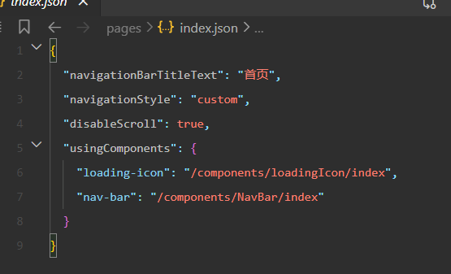
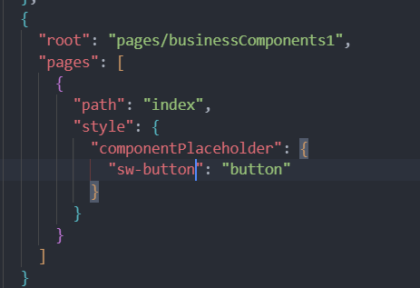

# uniApp中微信小程序异步分包插件

## 背景
在小程序开发中,主包大小限制2M,全局组件和依赖库都在主包中会很快就用完位置,导致无法上传.微信提供了异步分包让我们实现分包A加载分包B的组件,因此一些业务全局组件可以通过一个专门分包存放了

## 使用
```JSON
// subPackageA/pages/index.json
{
  "usingComponents": {
    "button": "../../commonPackage/components/button",
    "list": "../../subPackageB/components/full-list",
    "simple-list": "../components/simple-list",
    "plugin-comp": "plugin://pluginInSubPackageB/comp"
  },
  "componentPlaceholder": {
    "button": "view",
    "list": "simple-list",
    "plugin-comp": "view"
  }
}
```
在这个配置中,**usingComponents**引用我们需要使用的组件,而**componentPlaceholder**则表示我们使用占位符组件,当分包加载完成之后,占位符组件会被替换成真正的组件

button,list都是分包的组件,因此需要在componentPlaceholder中设置一个占位组件,他可以是默认组件,全局组件或者是当前分包组件

## uniapp中应用
在uniapp框架中，我们并没有像微信小程序中结构中直接使用json文件做配置，而是在vue文件里import引入了组件后，由uniapp帮我们编译成微信的模式


通过对比可以发现我们只需要参考在uniapp中配置usingComponents的地方，就可以把componentPlaceholder相关配置上。通过uniapp文档发现文档中并没有componentPlaceholder相关介绍，这是因为官方现在也没有明确支持编译，但我们能保证他编译出的结果和微信一致即可。因此可以直接这样设置

在page.json路由中的style里面设置componentPlaceholder


## 原理流程
### 1. 获取到根路径上pages.json文件并读取其中内容
```js
const fileDependencies = Array.from(compilation.fileDependencies) // 获取到当前这次打包中所有文件,并转为数组
const pagesJsonPath = fileDependencies.find(item => item.includes('/src/pages.json')) // 找到pages.json文件路径
const rootPageJSON = fs.readFileSync(rootPagePath, 'utf8') // 读取pages.json文件内容
return rootPageJSON
```

```JSON
// pages.json结构实例
{
  "pages": [],
  "subPackages": [
    {
      "root": "subPackageA",
      "pages": [
        {
					"path": "home/index",
					"style": {
						"componentPlaceholder": { // 该配置优先于全局
							"component-a": "view" 
						}
					}
				}
      ]
    },
    {
      "root": "subPackageB",
      "pages": [
        {
					"path": "tabs/index",
					"style": {
						"componentPlaceholder": {
							"component-b": "view"
						}
					}
				}
      ]
    }
  ],
  "componentPlaceholder": {
    "button-a": "button",
    "component-b": "button",
    "component-a": "picker"
  }
}
```
### 2. 获取全局的全部componentPlaceholder配置
根据上面uniapp的配置,我们其实可以直接只在分包中的页面路由的style里直接设置componentPlaceholder,但是因为项目过于庞大,要修改的涉及太多页面,
我们使用脚本自动帮我们完成全局的配置,同时也允许分包页面路由中继续设置componentPlaceholder,保留一定的自定义能力
```js
const rootPage = JSON.parse(rootPageJSON)
let allComponentPlaceholder = {}
Object.assign(allComponentPlaceholder, rootPage.componentPlaceholder || {}) // 获取全局的componentPlaceholder配置
const subPackages = rootPage.subPackages || []
if (subPackages.length) {
  subPackages.forEach(package => {
    if (package.pages && package.pages.length) {
      package.pages.forEach(page => {
        if (page.style && page.style.componentPlaceholder) {
          Object.assign(allComponentPlaceholder, page.style.componentPlaceholder) // 获取分包页面路由的componentPlaceholder配置
        }
      })
    }
  })
}
```

```js
// allComponentPlaceholder
{
  "button-a": "button",
  "component-b": "view",
  "component-a": "view"
}
```

### 3. 获取到打包文件后所有pages页面里的json文件列表
```js
const reg = /.*pages\/.*\.json$/
const jsonFiles = Object.keys(compilation.assets).filter(item => teg.test(item)) // 通过assets获取到编译后所有文件资源,过滤出页面中的json文件路径

// [
//   'pages/index.json',
//   'pages/subPackageA//home/index.json',
//   'pages/subPackageB/tabs/index.json',
//   'pages/businessComponents/componentA.json',
//   'pages/businessComponents/componentB.json',
// ]
```

### 4. 加入对应页面的json文件配置中
目前我们拿到打包后所有页面的json文件列表,只需要对他们进行循环,看每个json文件的usingComponents有没有用到了allComponentPlaceholder里同名的组件,
有的话就设置对应的componentPlaceholder占位组件进去,得到我们的最终目标
```json
// 我们的目标
{
    "navigationBarTitleText": "xxx",
    "usingComponents": {
        "component-a": "/pages/businessComponents/componentA",
        "component-b": "/pages/businessComponents/componentB",
    },
    "componentPlaceholder": {
        "component-a": "view",
        "component-b": "view",
    }
}

// allComponentPlaceholder
{
  "button-a": "button",
  "component-b": "view",
  "component-a": "view"
}
```

```js
for(const file of jsonFiles) {
  const fileSource = compilation.assets[file] && compilation.assets[file].source()
  if (!fileSource || typeof fileSource !== 'string') continue
  const source = JSON.parse(fileSource)
  const componentPlaceholder = {}
  // 判断当前usingComponents有没有使用到异步组件
  source.usingComponents && Object.keys(source.usingComponents).forEach(key => {
    if (allComponentPlaceholder[key]) {
      componentPlaceholder[key] = allComponentPlaceholder[key]
    }
  })

  // 把componentPlaceholder设置到json文件中去
  if (Object.keys(componentPlaceholder).length) {
    source.componentPlaceholder = componentPlaceholder
    const newContent = JSON.stringify(source)
    compilation.assets[file] = {
      source: () => newContent,
      length: newContent.length
    }
  }
}

```